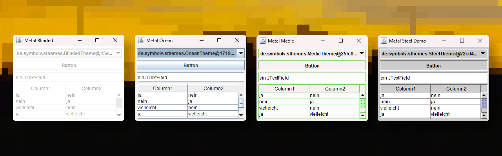

# SThemes

SThemes ist eine Java Bibliothek, welche verschiedene Themes für das Java Look & Feel (Metal (DefaultMetalTheme)) bereitstellt.
SThemes steht für `Steel Themes`. Steel, weil `DefaultMetalTheme` den Namen `Steel` trägt.
Lustigerweise ist `DefaultMetalTheme` nicht das Standardtheme des Metal Look & Feels, war es aber mal. Jetzt ist es `Ocean`.
Mir persönlich gefällt das `Steel` Metaltheme aber deutlich besser.
Diese Bibliothek wurde mit Java 17 getestet.

## Screenshots



## Installation

**Das muss in die pom.xml:**

```xml
<dependency>
    <groupId>de.schipplock.gui</groupId>
    <artifactId>sthemes</artifactId>
    <version>0.0.3</version>
</dependency>
```

## Wie verwende ich diese Bibliothek?

**Es wird folgender Import benötigt (je nachdem, welches Theme man nutzen möchte):**

```java
import de.schipplock.gui.MedicTheme;
import de.schipplock.gui.BlindedTheme;
import de.schipplock.gui.OceanTheme;
import de.schipplock.gui.SteelTheme;
```

**Das Theme ändern:**

```java
MetalLookAndFeel.setCurrentTheme(new SteelTheme());
UIManager.setLookAndFeel("javax.swing.plaf.metal.MetalLookAndFeel");
```

## License
[Apache License 2.0](https://choosealicense.com/licenses/apache-2.0/)